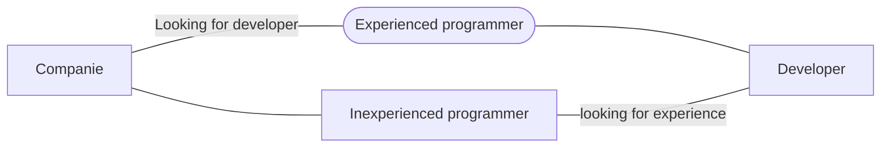

# Model Notes

This is a simple idea just to pratice concepts like MVVM, Lifecycle, LiveData and Design Patterns
Idea: An notes app (inspired by default google notes app) with the purpose of training concepts such as: **MVVM** , **LiveData** , **RecyclerView** , **ROOM** , **SerializableExtra**

## Technologies i've used

 - **MVVM** - Architecture choosed;
 - **ROOM** - Database to save my Notes and get the currently state (edit/delete);
 - **RecyclerView** - To list my data on UI;
 - **ViewBinding** - To get access to my View elements with less polution ( to not use FindViewById );
 - **LifeCycle** - Android lifecycle to avoid errors/crashs;
 - **LiveData** - With MVVM, LifeCycle and LiveData i can set Observables that can respect the lifecycle app components like activies, services or even fragments.

# APP Screenshot/Videos

  

## Diagram about companies

> Situation of companies today.

